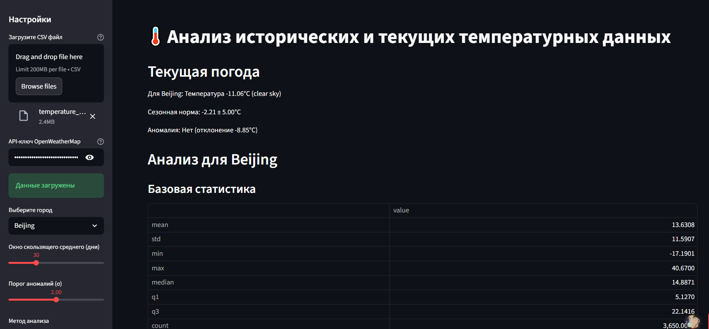
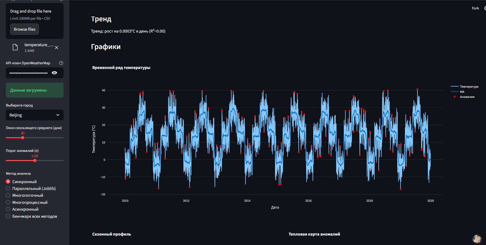

# 🌡️ Temperature Analysis & Real-Time Weather Dashboard


---

##  О проекте

Интерактивное приложение для анализа исторических температур и мониторинга текущей погоды через **OpenWeatherMap API**.

Принцип работы:
1. Загружаешь свой CSV с историческими данными.
2. Выбираешь город.
3. Видишь временные ряды, сезонные профили, аномалии и тренды.
4. Сравниваешь с текущей погодой в реальном времени.

> ⚠️ Файл для генерации данных: `src/create_temperature_data.py` (при необходимости можно создать CSV самостоятельно).

---
##  Попробовать онлайн

Приложение доступно в Streamlit Cloud:
[**Запустить приложение**](https://openweathermap-3nycusuhmvrpo4ifz5uzek.streamlit.app/)

##  Скриншоты интерфейса

Главная страница приложения:



Анализ выбранного города:




##  Возможности приложения

### Анализ исторических данных
- Временной ряд с **скользящим средним** и выделением аномалий.
- Сезонные профили (средние и стандартное отклонение по сезонам).
- **Boxplot** распределения температур по сезонам.
- **Тепловая карта** аномалий по годам и месяцам.
- Долгосрочный **линейный тренд**.

### Реальное время
- Текущая температура и описание погоды (через OpenWeatherMap API).
- Сравнение с исторической нормой сезона (аномалия или нет).

### Производительность и бенчмарк
- 6 способов обработки данных:
  - Синхронный
  - Параллельный (Joblib)
  - Многопоточный
  - Многопроцессный
  - Асинхронный
- **Выводы по производительности**:
  - **Синхронный** — базовый вариант, простой и предсказуемый, хорошо работает для небольших наборов данных.
  - **Joblib (параллельный)** — использует несколько процессов. При небольших объёмах данных часто работает медленнее синхронного из-за накладных расходов на запуск процессов и сериализацию данных.
  - **Многопоточный** — немного ускоряет выполнение для I/O-bound задач, но ограничен GIL при вычислениях, поэтому выигрыши небольшие.
  - **Многопроцессный** — накладные расходы на создание процессов и передачу данных делают его медленным для небольших задач.
  - **Асинхронный** — эффективен для операций с ожиданием (I/O) и лёгких вычислений, минимальные накладные расходы на управление задачами.

>⚠️ Заметьте: времена варьируются в зависимости от города и объёма данных. Основная закономерность сохраняется: Joblib и многопроцессный подходят для больших нагрузок, асинхронный — для I/O-heavy задач, синхронный и многопоточный — для небольших наборов данных.
---

##  Интерфейс
- Красивый интерактивный интерфейс на **Streamlit**.
- Интерактивные графики на **Plotly**.
- Удобный выбор города и отображение статистики в реальном времени.

---

## 🐳 Docker

Сборка образа:

```bash
docker build -t weather-streamlit .
```

Запуск контейнера:

```bash
docker run -p 8501:8501 weather-streamlit

```

Запуск контейнера:

```bash
http://localhost:8501

```
